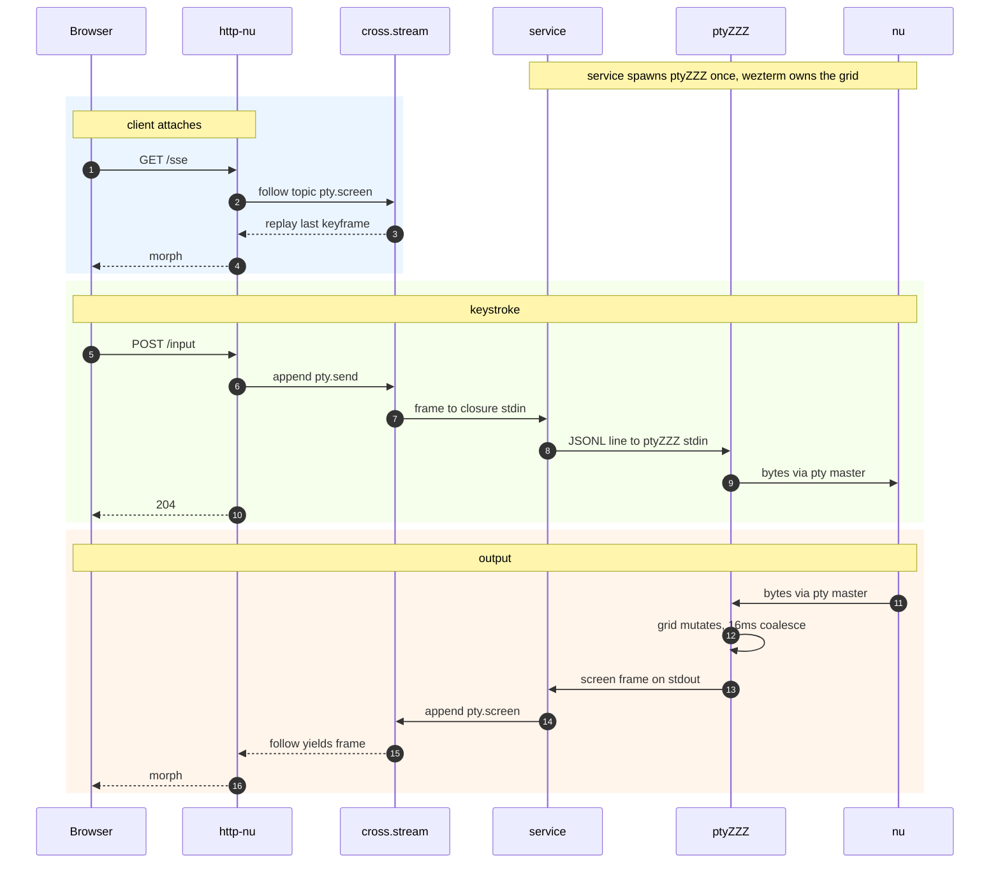

<h1>
<p align="center">
  ptyZZZ
  <br><br>
  <sup>A terminal as a unix pipe.</sup>
</p>
</h1>

<p align="center">
  <a href="https://discord.com/invite/YNbScHBHrh">
    
  </a>
</p>

https://github.com/user-attachments/assets/6cce5e50-480e-4252-a808-84bb8addb533

---

ptyZZZ runs a shell in a pty and renders its screen. It reads the shell's output,
parses it with [wezterm-term](https://github.com/wezterm/wezterm) into a grid of
character cells, and turns that grid into HTML. You send it keystrokes as JSONL on
stdin; it sends the rendered screen back as JSONL on stdout.

```
JSONL commands ──> ptyZZZ ──> JSONL screen frames
   (stdin)        pty + grid       (stdout)
```

It is a filter you can run in a pipe:

```
printf '{"t":"input","b":"ls\n"}\n' | ptyZZZ run -- nu
```

Or wire it to [cross.stream](https://cross.stream), so its screen lands on a log
and any number of readers can follow it. That second path is what the rest of
this is about.

## The protocol

Both directions are newline-delimited JSON, one object per line. Commands in:

```
{"t":"input","b":"ls\n"}              raw bytes for the pty
{"t":"resize","cols":80,"rows":24}
```

Screen out:

```
{"t":"screen","seqno":N,"cols":C,"rows":R,"html":"<div id=\"grid\"...>"}
{"t":"exit","code":N}
```

Output is coalesced over a 16ms window, so a burst like `cat big.txt` becomes one
frame instead of one per chunk.

ptyZZZ knows nothing about HTTP or cross.stream. It is a plain stdin/stdout
program. You can drive it from a shell pipe, and only one small adapter has to
know how to turn its output into stream frames.

## Why on a stream

[stacks2099](https://github.com/cablehead/stacks2099) already renders a pty
server-side this way, but each terminal opens its own SSE connection. A handful
of terminals plus the keystroke POSTs runs into the browser's ~6-connection
limit over HTTP/1.1, and input stalls. HTTP/2 sidesteps it, but needs TLS.

The other option is to put the screen on a log. If each terminal is a topic, one
connection can carry many of them, and you choose which to watch by which topics
you subscribe to. ptyZZZ is the piece that makes a terminal fit that model: a
plain process whose screen can become frames.

## As a cross.stream service

cross.stream services run a [Nushell](https://www.nushell.sh) closure as a
long-lived process. With `duplex: true`, frames appended to `<name>.send` are fed
to the closure's stdin; whatever the closure emits becomes `<name>.recv` frames.
The adapter is the only cross.stream-aware code in the project:

```nushell
{
  run: {||
    ^ptyZZZ run -- nu
    | lines | each {|l|
        let e = $l | from json
        match $e.t {
          screen => ( $e.html | .append pty.screen --ttl last:1 )
          exit   => ( {code: $e.code} | .append pty.exit )
        }
      } | ignore
  }
  duplex: true
}
```

`.send` frames become ptyZZZ's stdin. Each line ptyZZZ prints is matched on its
`t` field and appended to its own topic. The closure returns nothing
(`| ignore`), so cross.stream doesn't also copy the raw output onto a default
`.recv` topic.

The web tier is then a reader. The page opens one `/sse`, follows the
`pty.screen` topic, and morphs each frame into `#grid`. A keystroke POSTs to
`/input`, which appends a `pty.send` frame. The grid is rendered on the server,
not in the browser.



## The pipe that deadlocks

The first version wrote `$in | ^ptyZZZ run -- nu`, threading the service input
into ptyZZZ explicitly. It hung: the service went `active`, but no ptyZZZ process
appeared.

`$in` on a stream collects it before passing it on. The duplex input never ends,
so `$in` blocked waiting for it to finish and the external command was never
reached. The fix is to make the external the head of the pipeline. A duplex
service feeds its input to the first command's stdin directly, the way
`websocat | lines` does in the cross.stream docs. No `$in`. Worth knowing for any
service that wraps a long-running CLI.

## What goes on the log

A screen can be stored three ways: the full grid every frame, only the diffs, or
keyframes with diffs between them.

The full grid every frame bloats the log on every keystroke. Pure diffs can't
survive a cold replay: a diff is relative to wezterm's in-memory row ids and
sequence numbers, which never reach the log, so a fresh subscriber has nothing to
apply them to. Keyframes-plus-diffs is the fit, and the shape cross.stream's own
examples settle on: a snapshot frame (`ttl last:1`) plus deltas (`ttl time:Ns`)
that bridge to the next snapshot.

The 16ms window caps output at about 62 frames per second per terminal, however
fast the shell writes. The worst case for diffs is a full repaint, where every
visible row changes at once (htop, a vim redraw) -- and that is exactly where a
single keyframe is smaller than a stack of per-row diffs. So the writer can pick
per frame: a heavy repaint ships a keyframe; quiet typing ships a few changed
rows.

ptyZZZ v0 ships keyframes only. The diff path is the next step; the wire already
has room for it (`t` gains `diff`).

## HTML, not JSON

The frame body is rendered HTML, not a structured list of cells. There is one
writer and many readers, so the render should happen once, at the writer, and
each reader just forwards the bytes. Store cells instead and every `/sse`
connection has to rebuild the HTML itself, in Nushell, once per connection. JSON
is smaller on disk, but Brotli closes most of that gap on the wire -- and you'd
pay the render cost again on every connection, the exact path you wanted to keep
cheap.

## Key by the session, not the clip

Frames are keyed by the pty's session, so a closed pty's screen stays replayable
on the log, and a respawn (new session, same pane) is a swap the web tier makes,
not something the producer tracks. ptyZZZ only ever deals with one pty's bytes.
Tracking sessions and respawning them is the web tier's job, above it.

## Run it

```
cargo build --release            # builds ptyZZZ
http-nu --dev --datastar --services --store ./store 127.0.0.1:5111 serve.nu
```

Open http://127.0.0.1:5111 and type into the page. `serve.nu` registers the
service on boot and serves the one-page client.

Needs [http-nu](https://github.com/cablehead/http-nu) (`--store` for the log,
`--services` for the service, `--datastar` for the SSE helpers) and a `nu` on
PATH. The terminal-rendering code is copied from
[stacks2099](https://github.com/cablehead/stacks2099), packaged here as a
standalone program that can run on a stream.

## Driving it over HTTP

Input is a POST that appends a `pty.send` frame, so anything that can make an HTTP
request can type into the terminal. The body of `POST /input` is forwarded to the
pty verbatim, so a command and the carriage return that submits it are two writes:

```
# type a command, then submit it with a carriage return
curl -X POST 127.0.0.1:5111/input --data-binary 'cargo run --example mandelbrot'
curl -X POST 127.0.0.1:5111/input --data-binary $'\r'
```

Send any bytes the same way, control characters included. Ctrl-C is `\x03`, Tab is
`\t`, Escape is `\x1b`:

```
curl -X POST 127.0.0.1:5111/input --data-binary $'\x03'   # interrupt
```

Read the current screen once, or follow the live stream:

```
# latest frame, tags stripped to plain text
curl -s 127.0.0.1:5111/snap | sed 's/<[^>]*>/ /g'

# the SSE stream the browser uses
curl -sN 127.0.0.1:5111/sse
```

The browser page uses this same path: it sends keystrokes to `/input` and morphs
the screen frames into `#grid`.
