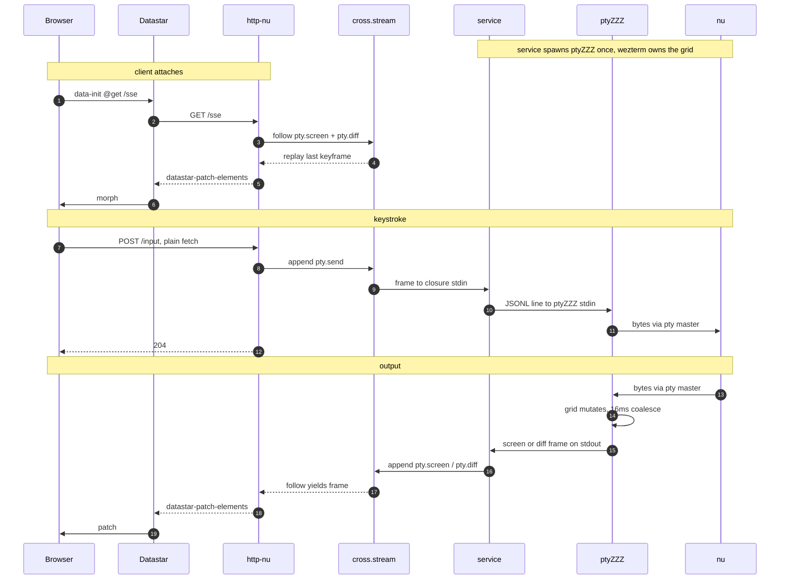

<h1>
<p align="center">
  ptyZZZ
  <br><br>
  <sup>A terminal as a unix pipe.</sup>
  <br><br>
  <a href="#install">Install</a>
  ·
  <a href="./PROTOCOL.md">Protocol</a>
  ·
  <a href="https://discord.com/invite/YNbScHBHrh">Discord</a>
</p>
</h1>

<p align="center">
  <a href="https://github.com/cablehead/ptyZZZ/releases">
    
  </a>
  <a href="https://discord.com/invite/YNbScHBHrh">
    
  </a>
</p>

https://github.com/user-attachments/assets/b0d48f3b-2adc-4dd4-99e3-cf04bf8e5265

---

ptyZZZ runs a shell in a pty and renders its screen. It reads the shell's output,
parses it with [wezterm-term](https://github.com/wezterm/wezterm) into a grid of
character cells, and turns that grid, scrollback included, into HTML. You send it
keystrokes as JSONL on stdin; it sends the rendered screen back as JSONL on stdout.

```
JSONL commands ──> ptyZZZ ──> JSONL screen frames
   (stdin)        pty + grid       (stdout)
```

It is a filter you can run in a pipe:

```
printf '{"t":"input","b":"ls\n"}\n' | ptyZZZ run -- nu
```

Or wire it to [cross.stream](https://cross.stream), so its screen lands on a log
and any number of readers can follow it. That second path is what the rest of
this is about.

## Install

### [eget](https://github.com/zyedidia/eget)

```bash
eget cablehead/ptyZZZ
```

### Homebrew (macOS)

```bash
# Homebrew now asks you to trust a third-party tap before installing from it
brew trust --formula cablehead/tap/ptyzzz
# or if you use a few of cablehead's projects, and trust me, the whole tap
# brew trust cablehead/tap
brew install cablehead/tap/ptyzzz
```

### From source

```bash
cargo build --release            # binary lands at target/release/ptyZZZ
```

Prebuilt binaries (macos-arm64, linux-arm64, linux-amd64) are on the
[releases page](https://github.com/cablehead/ptyZZZ/releases), built by the
shared [cablehead/pipelines](https://github.com/cablehead/pipelines) workflow.
Note that `serve.nu` and the cube example spawn the repo-local build at
`target/release/ptyZZZ`, so for those, build from source.

## The protocol

Both directions are newline-delimited JSON, one object per line. Commands in:

```
{"t":"input","b":"ls\n"}              raw bytes for the pty
{"t":"resize","cols":80,"rows":24}
```

Screen out:

```
{"t":"screen","seqno":N,"cols":C,"rows":R,"html":"<div id=\"grid\"...>"}
{"t":"diff","seqno":N,"target":"grid","patch":"...","append":"...","trim":["grid-r-0"]}
{"t":"exit","code":N}
```

`screen` is a keyframe: the scrollback (`--scrollback`, default 3000 lines) plus
the visible grid, one row div per line, with a cursor overlay. `diff` carries
only what changed since the last frame: patched rows, rows that scrolled into
history, and the ids of rows that fell off the top. Damage is tracked per row
and byte-identical output is suppressed, so an idle shell emits nothing. Output
is coalesced over a 16ms window (`--coalesce`), so a burst like `cat big.txt`
becomes one frame instead of one per chunk. [PROTOCOL.md](PROTOCOL.md) has the
full wire format.

ptyZZZ knows nothing about HTTP or cross.stream. It is a plain stdin/stdout
program. You can drive it from a shell pipe, and only one small adapter has to
know how to turn its output into stream frames.

## Why on a stream

[stacks2099](https://github.com/cablehead/stacks2099) already renders a pty
server-side this way, but each terminal opens its own SSE connection. A handful
of terminals plus the keystroke POSTs runs into the browser's ~6-connection
limit over HTTP/1.1, and input stalls. HTTP/2 sidesteps it, but needs TLS.

The other option is to put the screen on a log. If each terminal is a topic, one
connection can carry many of them, and you choose which to watch by which topics
you subscribe to. ptyZZZ is the piece that makes a terminal fit that model: a
plain process whose screen can become frames.

## As a cross.stream service

cross.stream services run a [Nushell](https://www.nushell.sh) closure as a
long-lived process. With `duplex: true`, frames appended to `<name>.send` are fed
to the closure's stdin; whatever the closure emits becomes `<name>.recv` frames.
The adapter is the only cross.stream-aware code in the project:

```nushell
{
  run: {||
    ^ptyZZZ run -- nu
    | lines | each {|l|
        let e = try { $l | from json } catch { null }
        if $e == null { return }
        match $e.t {
          'screen' => ( $e.html | .append 'pty.screen' --ttl last:1 )
          'diff'   => ( null | .append 'pty.diff' --ttl ephemeral --meta {body: $l} )
          'exit'   => ( {code: $e.code} | to json | .append 'pty.exit' --ttl last:1 )
          _ => null
        }
      } | ignore
  }
  duplex: true
}
```

`.send` frames become ptyZZZ's stdin. Each line ptyZZZ prints is matched on its
`t` field and appended to its own topic: keyframes to `pty.screen` (`last:1`,
the join point for new subscribers), diffs to `pty.diff` (`ephemeral`: live
followers get them, nothing is stored). Diffs carry their payload in frame
meta rather than the CAS -- an ephemeral frame is never stored, so a CAS write
would be disk I/O with no reader; skipping it cuts the append from ~30us to
under 1us and saves a CAS read per subscriber per diff. The closure returns
nothing (`| ignore`), so cross.stream doesn't also copy the raw output onto a
default `.recv` topic.

The web tier is then a reader. The page opens one `/sse` and follows both
topics. A keyframe is one morph of `#grid`. A diff expands to as many as three
datastar patch events: changed rows and the cursor morph by id, new rows append
into the grid, expired rows are removed. A keystroke POSTs to `/input`, which
appends a `pty.send` frame. The grid is rendered on the server, not in the
browser, and the page follows the tail like a terminal until you scroll back
through history.


```mermaid
sequenceDiagram
    autonumber
    participant Browser
    participant DS as Datastar
    participant HTTP as http-nu
    participant XS as cross.stream
    participant Svc as service
    participant Pty as ptyZZZ
    participant Sh as nu

    Note over Svc,Sh: service spawns ptyZZZ once, wezterm owns the grid

    Note over Browser,HTTP: client attaches
    Browser->>DS: data-init @get /sse
    DS->>HTTP: GET /sse
    HTTP->>XS: follow pty.screen + pty.diff
    XS-->>HTTP: replay last keyframe
    HTTP-->>DS: datastar-patch-elements
    DS->>Browser: morph #grid

    Note over Browser,Sh: keystroke
    Browser->>HTTP: POST /input, plain fetch
    HTTP->>XS: append pty.send
    XS->>Svc: frame to closure stdin
    Svc->>Pty: JSONL line to ptyZZZ stdin
    Pty->>Sh: bytes via pty master
    HTTP-->>Browser: 204

    Note over Sh,Browser: output
    Sh->>Pty: bytes via pty master
    Pty->>Pty: grid mutates, 16ms coalesce
    Pty->>Svc: screen or diff frame on stdout
    Svc->>XS: append pty.screen / pty.diff
    XS-->>HTTP: follow yields frame
    HTTP-->>DS: datastar-patch-elements
    DS->>Browser: patch #grid
```

## The pipe that deadlocks

The first version wrote `$in | ^ptyZZZ run -- nu`, threading the service input
into ptyZZZ explicitly. It hung: the service went `active`, but no ptyZZZ process
appeared.

`$in` on a stream collects it before passing it on. The duplex input never ends,
so `$in` blocked waiting for it to finish and the external command was never
reached. The fix is to make the external the head of the pipeline. A duplex
service feeds its input to the first command's stdin directly, the way
`websocat | lines` does in the cross.stream docs. No `$in`. Worth knowing for any
service that wraps a long-running CLI.

## What goes on the log

A screen can be stored three ways: the full grid every frame, only the diffs, or
keyframes with diffs between them.

The full grid every frame bloats the log on every keystroke. Pure diffs can't
survive a cold replay: a diff is relative to wezterm's in-memory row ids and
sequence numbers, which never reach the log, so a fresh subscriber has nothing to
apply them to. Keyframes plus diffs is the fit. The stored keyframe
(`ttl last:1`) is the join point; diffs are ephemeral, for live followers only.
While diffs are flowing, a fresh keyframe goes out every `--keyframe-interval`
seconds (default 5), so a joiner catches up from one keyframe and a missed or
misapplied diff heals within one interval.

The 16ms window caps output at about 62 frames per second per terminal, however
fast the shell writes. The worst case for diffs is a full repaint, where every
visible row changes at once (htop, a vim redraw) -- and that is exactly where a
single keyframe is smaller than a stack of per-row diffs. So the writer can pick
per frame: a heavy repaint ships a keyframe; quiet typing ships a few changed
rows.

ptyZZZ picks per burst: start, resize, alt-screen flips, and repaints that
touch more than half the rows ship a keyframe; everything else ships a diff.

## HTML, not JSON

The frame body is rendered HTML, not a structured list of cells. There is one
writer and many readers, so the render should happen once, at the writer, and
each reader just forwards the bytes. Store cells instead and every `/sse`
connection has to rebuild the HTML itself, in Nushell, once per connection. JSON
is smaller on disk, but Brotli closes most of that gap on the wire -- and you'd
pay the render cost again on every connection, the exact path you wanted to keep
cheap.

## Key by the session, not the clip

The topics here are fixed names (`pty.screen`, `pty.diff`). The shape a
multi-terminal app wants is topics keyed by the pty's session, so a closed
pty's screen stays replayable on the log, and a respawn (new session, same
pane) is a swap the web tier makes, not something the producer tracks. ptyZZZ
only ever deals with one pty's bytes. Tracking sessions and respawning them is
the web tier's job, above it.

## Run it

```
cargo build --release            # builds ptyZZZ
http-nu --dev --datastar --services --store ./store 127.0.0.1:5111 serve.nu
```

Open http://127.0.0.1:5111 and type into the page. `serve.nu` registers the
service on boot and serves the one-page client.

Needs [http-nu](https://github.com/cablehead/http-nu) (`--store` for the log,
`--services` for the service, `--datastar` for the SSE helpers) and a `nu` on
PATH. The renderer started as a copy of
[stacks2099](https://github.com/cablehead/stacks2099)'s; it has since grown
row-level damage tracking and the diff path.

## The cube

[examples/cube](examples/cube) is the bigger demo: six live ptyZZZ views on
the faces of a spinning CSS cube, one `/sse` carrying all of them. The front
face is an interactive nu shell with browser-native scrollback.

## Driving it over HTTP

Input is a POST that appends a `pty.send` frame, so anything that can make an HTTP
request can type into the terminal. The body of `POST /input` is forwarded to the
pty verbatim, so a command and the carriage return that submits it are two writes:

```
# type a command, then submit it with a carriage return
curl -X POST 127.0.0.1:5111/input --data-binary 'ls -la'
curl -X POST 127.0.0.1:5111/input --data-binary $'\r'
```

Send any bytes the same way, control characters included. Ctrl-C is `\x03`, Tab is
`\t`, Escape is `\x1b`:

```
curl -X POST 127.0.0.1:5111/input --data-binary $'\x03'   # interrupt
```

Read the current screen once, or follow the live stream:

```
# latest frame, tags stripped to plain text
curl -s 127.0.0.1:5111/snap | sed 's/<[^>]*>/ /g'

# the SSE stream the browser uses
curl -sN 127.0.0.1:5111/sse
```

The browser page uses this same path: it sends keystrokes to `/input` and morphs
the screen frames into `#grid`.
