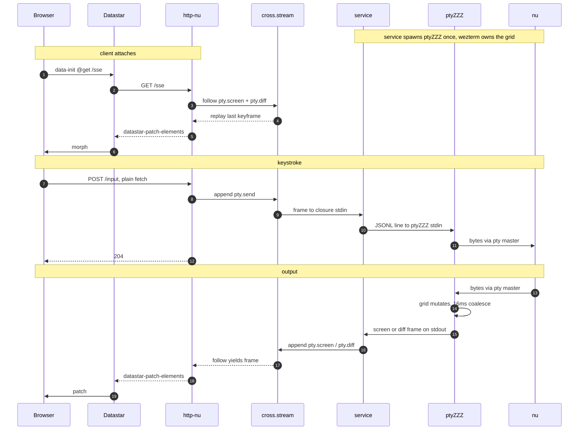

<h1>
<p align="center">
  ptyZZZ
</h1>
  <p align="center">
    A terminal as a unix pipe: keystrokes in as JSONL, the screen out as rendered HTML. Put a real shell in a web page with no emulator in the browser.
    <br />
    <a href="#install">Install</a>
    ·
    <a href="./PROTOCOL.md">Protocol</a>
    ·
    <a href="https://discord.com/invite/YNbScHBHrh">Discord</a>
  </p>
</p>

<p align="center">
  <a href="https://github.com/cablehead/ptyZZZ/releases">
    
  </a>
  <a href="https://discord.com/invite/YNbScHBHrh">
    
  </a>
</p>

https://github.com/user-attachments/assets/b0d48f3b-2adc-4dd4-99e3-cf04bf8e5265

---

ptyZZZ runs a shell in a pty and emulates the terminal on the server. It parses
the shell's output with [wezterm-term](https://github.com/wezterm/wezterm) into
a grid of cells, then renders the grid, scrollback included, as HTML.
Keystrokes go in as JSONL on stdin. Screen frames come out as JSONL on stdout.

```
JSONL commands ──> ptyZZZ ──> JSONL screen frames
   (stdin)        pty + grid       (stdout)
```

The browser gets finished HTML, so it runs no terminal emulator and holds no
terminal state. Use ptyZZZ to put a real shell in a web page without
[xterm.js](https://xtermjs.org) or
[ghostty-web](https://github.com/coder/ghostty-web). One terminal can feed any
number of viewers.

## Try it

```bash
eget cablehead/ptyZZZ    # or see Install below
printf '{"t":"input","b":"ls\\n"}\n' | ptyZZZ run -- nu
```

This spawns `nu` in a pty and types `ls` into it. Screen frames print to
stdout until stdin closes.

The browser view needs [http-nu](https://github.com/cablehead/http-nu), a `nu`
on PATH, and a source build (`serve.nu` spawns the repo-local binary):

```bash
cargo build --release
http-nu --dev --datastar --services --store ./store 127.0.0.1:5111 serve.nu
```

Open http://127.0.0.1:5111 and type into the page. The shell runs on the
server. The page just morphs the HTML it receives.

The bigger demo is [examples/cube](examples/cube): six live terminals on the
faces of a spinning CSS cube, and one SSE connection carries all six. The
front face is an interactive shell with browser-native scrollback.

## Why the emulator lives on the server

The usual web terminal runs the emulator in the browser: xterm.js, or now
ghostty-web. The server holds the pty and proxies raw bytes both ways.

That works until the browser tab goes away. Any version of it that survives
disconnects grows a server-side session, and the session has jobs beyond
keeping the shell alive:

- Programs query the terminal (where is the cursor, what kind of terminal is
  this) and block until something answers. With no browser attached, the
  server must answer.
- A browser that reconnects needs the current screen. Replaying saved bytes
  fails: a ring buffer can drop you into the middle of an escape sequence, and
  the screen comes up scrambled.

Both jobs take a terminal emulator. tmux settled this long ago: its server
parses every byte the shell writes into an in-memory grid, and on attach it
repaints that grid from scratch. A tmux client never sees the shell's raw
output.

So the proxy design ends up running two full emulators, one on each side of
the wire. Wherever their parsers disagree, the screen corrupts. ptyZZZ keeps
one. wezterm-term owns the grid next to the pty, and the browser renders the
HTML it is sent.

[stacks2099](https://github.com/cablehead/stacks2099) has run this shape for a
while, and its sessions stopped corrupting when the client emulator went away.
Its [journey.md](https://github.com/cablehead/stacks2099/blob/main/journey.md)
covers the road from xterm.js and a byte proxy to here. ptyZZZ packages the
result as a standalone process. The renderer started as a copy of
stacks2099's and has since grown row-level damage tracking and diffs.

## Install

### [eget](https://github.com/zyedidia/eget)

```bash
eget cablehead/ptyZZZ
```

### Homebrew (macOS)

```bash
# Homebrew now asks you to trust a third-party tap before installing from it
brew trust --formula cablehead/tap/ptyzzz
# or if you use a few of cablehead's projects, and trust me, the whole tap
# brew trust cablehead/tap
brew install cablehead/tap/ptyzzz
```

### From source

```bash
cargo build --release            # binary lands at target/release/ptyZZZ
```

Prebuilt binaries (macos-arm64, linux-arm64, linux-amd64) are on the
[releases page](https://github.com/cablehead/ptyZZZ/releases), built by the
shared [cablehead/pipelines](https://github.com/cablehead/pipelines) workflow.
`serve.nu` and the cube example spawn the repo-local build at
`target/release/ptyZZZ`, so for those, build from source.

## The protocol

Both directions are newline-delimited JSON, one object per line. Commands in:

```
{"t":"input","b":"ls\n"}              raw bytes for the pty
{"t":"resize","cols":80,"rows":24}
```

Screen out:

```
{"t":"screen","seqno":N,"cols":C,"rows":R,"html":"<div id=\"grid\"...>"}
{"t":"diff","seqno":N,"target":"grid","patch":"...","append":"...","trim":["grid-r-0"]}
{"t":"exit","code":N}
```

`screen` is a keyframe: the visible grid plus scrollback (`--scrollback`,
default 3000 lines), one row div per line, with a cursor overlay. `diff`
carries only what changed since the last frame: patched rows, rows newly
scrolled into history, and the ids of rows that fell off the top.

Damage is tracked per row, and unchanged output is suppressed, so an idle
shell emits nothing. Output coalesces over a 16ms window (`--coalesce`), so a
burst like `cat big.txt` becomes one frame instead of one per chunk.
[PROTOCOL.md](PROTOCOL.md) has the full wire format.

ptyZZZ knows nothing about HTTP or cross.stream. It is a plain stdin/stdout
program. The rest of this README connects it to
[cross.stream](https://cross.stream), which puts the screen on a log that many
readers can follow. The adapter for that is a few lines of Nushell, and an
adapter for anything else that reads JSON lines would look much the same.

## Why on a stream

stacks2099 already renders a pty server-side, but each terminal opens its own
SSE connection. A handful of terminals plus keystroke POSTs hits the browser's
~6-connection limit on HTTP/1.1, and input stalls. HTTP/2 avoids the limit but
needs TLS.

A log removes the limit a different way. Each terminal is a topic. One
connection carries as many terminals as you subscribe to.

## As a cross.stream service

cross.stream services run a [Nushell](https://www.nushell.sh) closure as a
long-lived process. With `duplex: true`, frames appended to `<name>.send` feed
the closure's stdin, and whatever the closure emits becomes `<name>.recv`
frames. This adapter is the only cross.stream-aware code in the project:

```nushell
{
  run: {||
    ^ptyZZZ run -- nu
    | lines | each {|l|
        let e = try { $l | from json } catch { null }
        if $e == null { return }
        match $e.t {
          'screen' => ( $e.html | .append 'pty.screen' --ttl last:1 )
          'diff'   => ( null | .append 'pty.diff' --ttl ephemeral --meta {body: $l} )
          'exit'   => ( {code: $e.code} | to json | .append 'pty.exit' --ttl last:1 )
          _ => null
        }
      } | ignore
  }
  duplex: true
}
```

Each line ptyZZZ prints is matched on its `t` field and appended to a topic.
Keyframes go to `pty.screen` with `ttl last:1`; the stored keyframe is where a
new subscriber starts. Diffs go to `pty.diff` as ephemeral frames: live
followers see them, nothing is stored.

Diffs carry their payload in frame meta rather than the CAS. A CAS write for a
frame that is never stored would be disk I/O nobody reads. Skipping it cuts
the append from ~30us to under 1us. The closure ends with `| ignore` so
cross.stream doesn't also copy raw output onto a default `.recv` topic.

One pitfall: the external command must be the head of the closure pipeline.
`$in | ^ptyZZZ run -- nu` deadlocks, because `$in` collects its whole input
first and a duplex input stream never ends. The service already feeds `.send`
frames to the head command's stdin.

The web tier is a reader. The page opens one `/sse` and follows both topics. A
keyframe is one morph of `#grid`. A diff becomes up to three patch events:
changed rows and the cursor morph by id, new rows append into the grid, and
expired rows are removed. A keystroke POSTs to `/input`, which appends a
`pty.send` frame. The page follows the tail like a terminal until you scroll
back into history.


```mermaid
sequenceDiagram
    autonumber
    participant Browser
    participant DS as Datastar
    participant HTTP as http-nu
    participant XS as cross.stream
    participant Svc as service
    participant Pty as ptyZZZ
    participant Sh as nu

    Note over Svc,Sh: service spawns ptyZZZ once, wezterm owns the grid

    Note over Browser,HTTP: client attaches
    Browser->>DS: data-init @get /sse
    DS->>HTTP: GET /sse
    HTTP->>XS: follow pty.screen + pty.diff
    XS-->>HTTP: replay last keyframe
    HTTP-->>DS: datastar-patch-elements
    DS->>Browser: morph #grid

    Note over Browser,Sh: keystroke
    Browser->>HTTP: POST /input, plain fetch
    HTTP->>XS: append pty.send
    XS->>Svc: frame to closure stdin
    Svc->>Pty: JSONL line to ptyZZZ stdin
    Pty->>Sh: bytes via pty master
    HTTP-->>Browser: 204

    Note over Sh,Browser: output
    Sh->>Pty: bytes via pty master
    Pty->>Pty: grid mutates, 16ms coalesce
    Pty->>Svc: screen or diff frame on stdout
    Svc->>XS: append pty.screen / pty.diff
    XS-->>HTTP: follow yields frame
    HTTP-->>DS: datastar-patch-elements
    DS->>Browser: patch #grid
```

## What goes on the log

A screen can go on the log three ways: full grids, only diffs, or keyframes
with diffs between them.

Full grids bloat the log on every keystroke. Diffs alone can't survive a cold
replay, because a diff refers to wezterm's in-memory row ids and those never
reach the log. A fresh subscriber would have nothing to apply it to.

Keyframes plus diffs work. The stored keyframe (`ttl last:1`) is where a new
subscriber starts; diffs are ephemeral. While diffs flow, a fresh keyframe
still goes out every `--keyframe-interval` seconds (default 5), so a missed or
misapplied diff heals within one interval.

The 16ms window caps output near 62 frames per second per terminal, no matter
how fast the shell writes. The worst case for diffs is a full repaint (htop, a
vim redraw), where every visible row changes at once. That is also where one
keyframe is smaller than a stack of row diffs. So ptyZZZ chooses per burst:
start, resize, alt-screen flips, and repaints that touch more than half the
rows ship a keyframe. Everything else ships a diff.

## HTML, not JSON

The frame body is rendered HTML, not a structured list of cells. One writer
serves many readers, so the render should happen once, at the writer, and each
reader should just forward bytes. If the log stored cells, every `/sse`
connection would rebuild the HTML itself, in Nushell, on every frame. JSON is
smaller on disk, but Brotli closes most of that gap on the wire, and the
per-connection render cost would remain.

## Key by the session, not the clip

The topics here are fixed names (`pty.screen`, `pty.diff`). A multi-terminal
app wants topics keyed by the pty's session. Then a closed pty's screen stays
replayable on the log, and respawning a pane is just the web tier switching to
a new session's topics. ptyZZZ only ever handles one pty. Sessions belong a
layer above it.

## Driving it over HTTP

Input is a POST that appends a `pty.send` frame, so anything that can make an
HTTP request can type into the terminal. The body of `POST /input` goes to the
pty verbatim. A command and the carriage return that submits it are two
writes:

```
curl -X POST 127.0.0.1:5111/input --data-binary 'ls -la'
curl -X POST 127.0.0.1:5111/input --data-binary $'\r'
```

Control characters work the same way. Ctrl-C is `\x03`, Escape is `\x1b`:

```
curl -X POST 127.0.0.1:5111/input --data-binary $'\x03'   # interrupt
```

Read the current screen once, or follow the live stream:

```
# latest frame, tags stripped to plain text
curl -s 127.0.0.1:5111/snap | sed 's/<[^>]*>/ /g'

# the SSE stream the browser uses
curl -sN 127.0.0.1:5111/sse
```

The browser page uses the same path: keystrokes POST to `/input`, and frames
morph into `#grid`.
